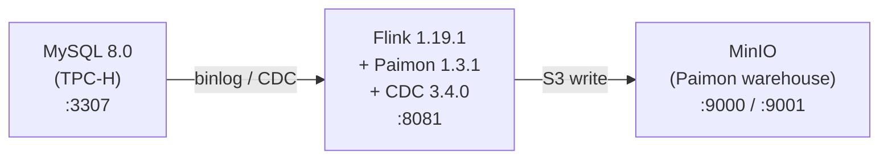

# Paimon CDC 实时入湖 — 基于 TPC-H Benchmark

基于 Docker 一键搭建 **MySQL CDC → Apache Paimon** 实时入湖环境，使用 TPC-H 标准 Benchmark 表模型作为业务数据。

## 架构



## 版本

| 组件                | 版本   |
| ------------------- | ------ |
| Flink               | 1.19.1 |
| Paimon              | 1.3.1  |
| Flink CDC Connector | 3.4.0  |
| MySQL               | 8.0    |
| MinIO               | latest |

## 快速启动

### 1. 启动环境

```bash
cd paimon/cdc-ingestion
docker-compose up -d --build
```

```bash
# 检查服务状态
docker-compose ps

# 等待 Flink Web UI 可用
until curl -s http://localhost:8081/overview > /dev/null 2>&1; do
  echo "Waiting for Flink..."
  sleep 3
done
echo "Flink is ready!"
```

### 2. 提交 CDC 整库同步作业

使用 Paimon Flink Action 一键同步 MySQL 全库到 Paimon：

```bash
docker-compose exec jobmanager ./bin/flink run \
  /opt/flink/lib/paimon-flink-action-1.3.1.jar \
  mysql-sync-database \
  --warehouse s3://paimon/warehouse \
  --database tpch \
  --mysql-conf hostname=mysql \
  --mysql-conf port=3306 \
  --mysql-conf username=root \
  --mysql-conf password=123456 \
  --mysql-conf database-name=tpch \
  --catalog-conf s3.endpoint=http://minio:9000 \
  --catalog-conf s3.access-key=admin \
  --catalog-conf s3.secret-key=admin123456 \
  --catalog-conf s3.path.style.access=true \
  --table-conf changelog-producer=input \
  --table-conf snapshot.time-retained=1h
```

提交后：
- 打开 [Flink Web UI](http://localhost:8081) 确认作业状态为 **RUNNING**
- 等待约 30 秒让初始全量快照完成

### 3. 验证初始数据

进入 Flink SQL Client 查询 Paimon 表：

```bash
docker-compose exec jobmanager ./bin/sql-client.sh
```

在 SQL Client 中执行：

```sql
-- 创建 Paimon Catalog
CREATE CATALOG paimon_catalog WITH (
    'type' = 'paimon',
    'warehouse' = 's3://paimon/warehouse',
    's3.endpoint' = 'http://minio:9000',
    's3.access-key' = 'admin',
    's3.secret-key' = 'admin123456',
    's3.path.style.access' = 'true'
);

USE CATALOG paimon_catalog;
USE tpch;

-- 查看各表行数
SELECT 'orders' AS tbl, COUNT(*) AS cnt FROM orders;

-- 查看快照历史
SELECT * FROM orders$snapshots ORDER BY snapshot_id DESC LIMIT 5;

-- 查看订单状态分布
SELECT o_orderstatus, COUNT(*) FROM orders GROUP BY o_orderstatus;
```

### 4. 模拟 CDC 变更

模拟脚本支持两种模式：

**一次性模式** — 执行 6 个固定阶段（INSERT → UPDATE → DELETE）：

```bash
docker-compose exec mysql bash /opt/scripts/simulate-cdc-changes.sh
```

**持续模式** — 在指定时间内持续产生随机 CDC 变更：

```bash
# 持续运行 120 秒，随机产生 INSERT/UPDATE/DELETE
docker-compose exec mysql bash /opt/scripts/simulate-cdc-changes.sh --duration 120
```

持续模式下的操作分布：
- **50%** 新建订单（随机客户、随机金额、1-3 条 lineitem）
- **30%** 更新订单状态（O→F→P 随机流转）
- **10%** 更新发货状态
- **10%** 删除已完成订单

> **推荐玩法**：在一个终端启动持续模式，另一个终端用 Flink SQL streaming 模式实时观察变化：
>
> ```sql
> SET 'execution.runtime-mode' = 'streaming';
> SET 'sql-client.execution.result-mode' = 'changelog';
> SELECT * FROM orders;
> ```

### 5. 验证变更已同步

回到 Flink SQL Client：

```sql
-- 查看快照数量是否增加
SELECT * FROM orders$snapshots ORDER BY snapshot_id DESC LIMIT 10;

-- 验证新订单
SELECT * FROM orders WHERE o_orderkey >= 100;

-- 验证删除（订单 104 应消失）
SELECT * FROM orders WHERE o_orderkey = 104;

-- 验证状态变更
SELECT o_orderstatus, COUNT(*) FROM orders GROUP BY o_orderstatus;

-- 查看 changelog（审计日志）
SELECT * FROM orders$audit_log LIMIT 20;
```

## 学习检查清单

完成上述操作后，你应该能理解：

- [ ] Paimon 的 **Catalog** 概念（基于 S3/文件系统的元数据管理）
- [ ] **Primary Key 表** 的 upsert 行为（INSERT 变 UPDATE 的自动合并）
- [ ] **Snapshot** 机制（每次 checkpoint 生成一个 snapshot）
- [ ] **$snapshots** 系统表（查看表的历史版本）
- [ ] **$audit_log** 系统表（查看每条记录的变更类型：+I, -U, +U, -D）
- [ ] CDC **全量快照** → **增量同步**的完整流程
- [ ] `mysql-sync-database` Action 的一键整库同步能力
- [ ] Paimon 在 MinIO 上的文件组织结构（warehouse/db/table/bucket/data）

## 进阶探索

### 查看 MinIO 存储结构

打开 [MinIO Console](http://localhost:9001)（用户名: `admin`, 密码: `admin123456`），浏览 `paimon/warehouse/tpch.db/` 目录：

```
warehouse/
└── tpch.db/
    ├── orders/
    │   ├── snapshot/          # 快照文件
    │   ├── manifest/          # 清单文件
    │   ├── schema/            # 表结构
    │   └── bucket-0/          # 数据文件
    ├── lineitem/
    ├── customer/
    └── ...
```

### 使用 TPC-H 查询

参考 `flink-sql/03-query-paimon.sql` 中的 TPC-H Q1 和 Q3 简化版查询。

### 流式消费 Changelog

```sql
-- 以流模式查看 orders 表的实时变更
SET 'execution.runtime-mode' = 'streaming';
SET 'sql-client.execution.result-mode' = 'changelog';

SELECT * FROM orders;
```

## 清理

```bash
docker-compose down -v
```

## 常见问题

**Q: Flink 作业提交失败，提示找不到 jar？**
A: 确认 Docker 镜像已正确构建，执行 `docker-compose build --no-cache` 重建。

**Q: CDC 同步无数据？**
A: 检查 MySQL binlog 是否开启：`docker-compose exec mysql mysql -uroot -p123456 -e "SHOW VARIABLES LIKE 'log_bin'"`

**Q: MinIO 访问报错？**
A: 确认 bucket 已创建：`docker-compose logs createbuckets`
